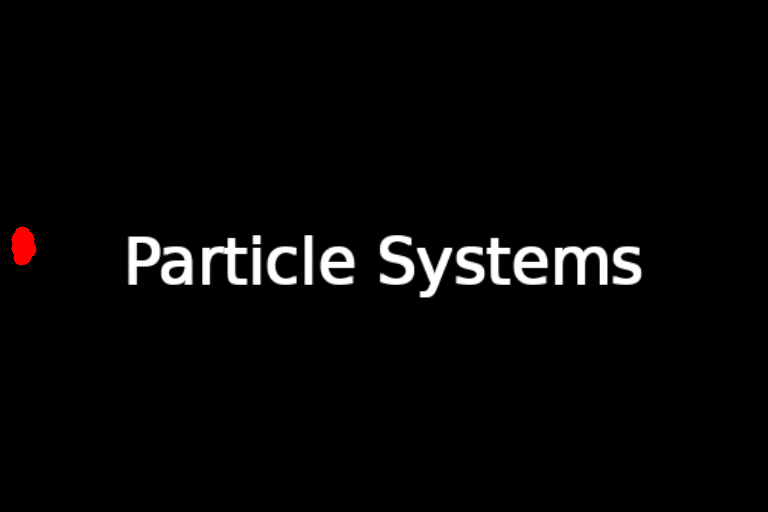
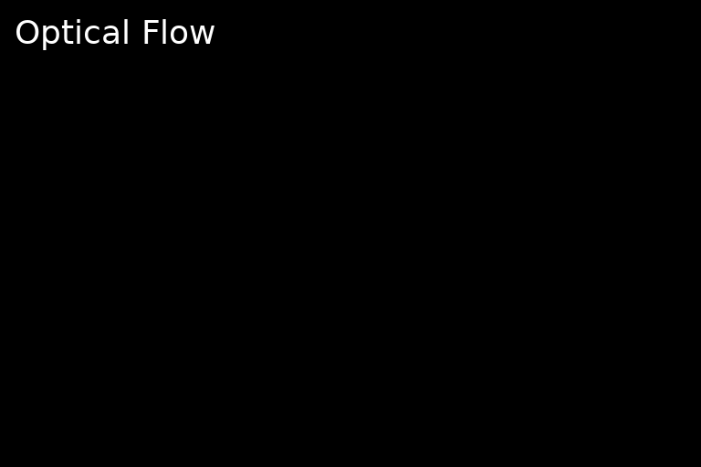
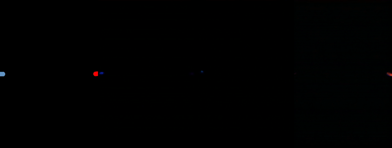
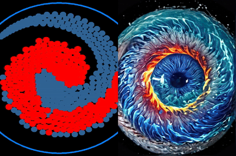

# ComfyUI RyanOnTheInside Node Pack

## Overview
### RyanOnTheInside node pack introduces dynamic features to ComfyUI:
  **Dynamic Reactivity**: Almost all nodes in this pack can be made to react to audio, MIDI, motion, time, color, depth, brightness, and more, allowing for incredibly dynamic and responsive workflows. If a node prefixed with  FLEX, then this  reactivity is central to its functionality.**

- 🎆 **Particle Systems**: Create mesmerizing, fluid-like effects
- 🎵 **Audio & MIDI Processing**: Separate instruments and create audio-reactive visuals
- 🎛️ **Flex Features**: Dynamic control over IPAdapters, Masks, and Images
- 🌊 **Optical Flow**: Generate masks based on motion in videos
- ⏳ **Temporal Effects**: Apply time-based transformations to masks and images


<table style="border-collapse: collapse; border: none;">
  <tr>
    <td style="border: none; padding: 0 2px 2px 0;"></td>
    <td style="border: none; padding: 0 0 2px 2px;"></td>
  </tr>
  <tr>
    <td style="border: none; padding: 2px 2px 0 0;">
      <br>
      
    </td>
    <td style="border: none; padding: 2px 0 0 2px;"></td>
  </tr>
  <tr>
    <td colspan="2" style="border: none; padding: 2px 0 0 0;"></td>
  </tr>
</table>

*Examples showcasing various effects using particle emitters, vortices, and other node features*

##### 🆕 Recent Updates
-9/25/24 - **FlexImageContrast**: Adds contrast and brightness to images, with an option to preserve luminosity.
-9/15/24 - **alot** Depth From Shape, Audio Pitch Feature, Pitch Range  filters, new MIDI keybord for Pitch Range specification, Image from audio, mask from audio, Improved depth chamber, wave propagation, emanating rings,   and a lot more 
- 9/8/24 - **Area Feature**: Adds area  as a  driving reactivity feature!
- 9/7/24 - **Proximity Feature**: Adds proximity as a driving reactivity feature! Allows for the distince of objects from one another to control other nodes.
- 9/5/24 - **FlexImageParallax**: Add illusory depth.
- 9/3/24 - **FlexMaskDepthChamber**: Mask anything within a given depth range
- 9/3/24 - **FeatureFade**: another feature modifier  to allow mixing of features, controled by features. Think mixing depth and motion features according to a kick drum or somthing. Ridiculous.
- 9/1/24 - **Utility Nodes**: Added many utility nodes for batch manipulation and more
- 8/31/24 - **FlexMaskRandomShapes**: Create dynamic shapes. Cooler than it sounds!
- 8/30/24 - **FlexMaskEmanatingRings**: Create dynamic, expanding ring patterns emanating from mask edges.
- 8/30/24 - **FlexMaskWavePropagation**: Simulate wave-like distortions propagating from mask boundaries.
- 8/29/24 - **Added feature reactivity to paricle simulations**

## 🚀 Quick Start

Getting started with the RyanOnTheInside node pack is easy:

1. Install the node pack as described in the Installation section.
2. Open ComfyUI and look for nodes prefixed with "RyanOnTheInside" in the node browser.
3. Check out the example workflows on Civitai to see how different features can be used.

### Example and Tutorial Workflows on Civitai

For a range of example and tutorial workflows showcasing the capabilities of this node pack, visit my Civitai profile:

[RyanOnTheInside Civitai Profile](https://civitai.com/user/RyanOnTheInside)

## ❓ Help and Documentation

For detailed information on each and every node, click the ❓ icon present in the top-right corner of the node.


## 🚀 Key Features
Particles are now reactive!
### 🎛️ Flex Features
Dynamic control over various aspects of your workflow:
- Modulate IPAdapters, Masks, Images, and Particles based on extracted features
- Features include: Audio, MIDI, Motion, Proximity Depth, Color, Time, and more
- Create adaptive, responsive effects that evolve with your input data

### 🎆 Particle Systems
- Multiple particle emitters with customizable settings
- Force fields (Gravity Wells and Vortices) for complex interactions
- Boundary-respecting particles and static body interactions
- Time-based particle modulation (size, speed, color)

### 🎵 Audio and MIDI Processing
- Separate audio into individual instrument tracks
- Extract features from audio and MIDI for visual effects
- Create audio-reactive animations and transformations

### 🌊 Optical Flow
- Generate masks based on movement in video sequences
- Multiple optical flow algorithms available
- Create motion-reactive particle simulations

### ⏳ Temporal Effects
- Apply time-based transformations to masks and images
- Create evolving animations with various effects (erosion, dilation, warping)
- Customize with easing functions and palindrome support

## 📚 Detailed Documentation

<details>
<summary><h3>Flex Features</h3></summary>

The Flex Features system allows for dynamic control over various aspects of your workflow by extracting and utilizing different types of features:

#### Audio Features
- **Amplitude Envelope**: Tracks the overall volume changes in the audio
- **RMS Energy**: Measures the average energy of the audio signal
- **Spectral Centroid**: Indicates the "center of mass" of the spectrum
- **Onset Detection**: Detects the beginning of musical notes or events
- **Chroma Features**: Represents the tonal content of the audio

#### MIDI Features
- **Velocity**: Intensity of MIDI note presses
- **Pitch**: Musical note values
- **Note On/Off**: Timing of note starts and ends
- **Duration**: Length of individual notes
- **Density**: Number of active notes over time
- **Pitchbend**: Pitch modulation data
- **Aftertouch**: Pressure applied after initial note press
- **Various CC (Control Change) data**: Modulation, expression, sustain, etc.

#### Motion Features
- **Mean Motion**: Average movement across the frame
- **Max Motion**: Largest movement detected
- **Motion Direction**: Overall direction of movement
- **Horizontal/Vertical Motion**: Movement along specific axes
- **Motion Complexity**: Variation in movement across the frame

#### Depth Features
- **Mean Depth**: Average depth in the scene
- **Depth Variance**: Variation in depth values
- **Depth Range**: Difference between nearest and farthest points
- **Gradient Magnitude**: Rate of depth change
- **Foreground/Midground/Background Ratios**: Proportion of scene at different depths

#### Color Features
- **Dominant Color**: Most prevalent color in the image
- **Color Variance**: Spread of colors used
- **Saturation**: Intensity of colors
- **RGB Ratios**: Proportion of red, green, and blue in the image

#### Brightness Features
- **Mean Brightness**: Overall lightness of the image
- **Brightness Variance**: Spread of light and dark areas
- **Brightness Histogram**: Distribution of brightness levels
- **Dark/Mid/Bright Ratios**: Proportion of image at different brightness levels

#### Time Features
- **Smooth**: Linear progression over time
- **Accelerate**: Increasing rate of change
- **Pulse**: Periodic oscillation
- **Sawtooth**: Rapid rise followed by sudden drop
- **Bounce**: Emulates a bouncing motion

These features can be used to control IPAdapters, Masks, and Images, creating dynamic and responsive effects that adapt to the input data.

</details>

<details>
<summary><h3>Particle Systems</h3></summary>

Create mesmerizing, fluid-like effects through advanced particle simulation:

- **Multiple Emitters**: Create complex particle flows with independent settings
  - Customize spread, speed, size, color, and more for each emitter
- **Force Fields**: Add depth to your simulations
  - Gravity Wells: Attract or repel particles
  - Vortices: Create swirling, tornado-like effects
- **Global Settings**: Fine-tune the overall simulation
  - Adjust gravity and wind for the entire particle space
- **Boundary Interactions**: Particles respect mask shapes and edges
- **Static Bodies**: Add obstacles and surfaces for particles to interact with
- **Spring Joints**: Create interconnected particle systems
- **Time-based Modulation**: Evolve particle properties over time
  - Adjust size, speed, and color dynamically

These features allow for the creation of complex, dynamic particle effects that can be used to generate masks, animate elements, or create stunning visual effects.

</details>

<details>
<summary><h3>Audio and MIDI Processing</h3></summary>

Transform your visuals with the power of sound and musical data:

#### Audio Processing
- **Track Separation**: Isolate vocals, drums, bass, and other instruments
- **Feature Extraction**: Analyze audio for amplitude, frequency, and tonal content
- **Frequency Filtering**: Target specific frequency ranges for processing
- **Visualizations**: Create complex audio-reactive visual effects

#### MIDI Processing
- **Feature Extraction**: Utilize note velocity, pitch, timing, and control data
- **Real-time Input**: Process live MIDI data for interactive visuals
- **Sequencing**: Create rhythmic visual patterns based on MIDI sequences
- **Control Mapping**: Use MIDI controllers to adjust visual parameters

These audio and MIDI processing capabilities enable the creation of music-driven animations, visualizations, and effects that respond dynamically to sound input.

</details>

<details>
<summary><h3>Optical Flow</h3></summary>

Harness the power of motion to create stunning visual effects:

- **Multiple Algorithms**: Choose from various optical flow calculation methods
  - Farneback: Dense optical flow estimation
  - Lucas-Kanade: Sparse feature tracking
  - Pyramidal Lucas-Kanade: Multi-scale feature tracking for larger motions
- **Motion-based Masking**: Generate masks that highlight areas of movement
- **Flow Visualization**: Create visual representations of motion in video
- **Particle Interaction**: Use optical flow data to influence particle systems
- **Directional Effects**: Apply effects based on the direction of detected motion

Optical flow analysis allows for the creation of dynamic, motion-responsive effects that can be used for masking, animation, or as input for other visual processes.

</details>

<details>
<summary><h3>Temporal Effects</h3></summary>

Add the dimension of time to your mask and image effects:

- **Morphological Operations**: Apply time-varying erosion, dilation, opening, and closing
- **Geometric Transformations**: Animate translation, rotation, and scaling over time
- **Mask Combinations**: Blend multiple masks with time-based operations
- **Warping Effects**: Create dynamic distortions using Perlin noise, radial, or swirl patterns
- **Easing Functions**: Customize the rate of change for smooth animations
- **Palindrome Mode**: Create seamless back-and-forth animations

These temporal effects enable the creation of evolving, dynamic animations that transform masks and images over the course of your video or animation sequence.

</details>

## Installation

Install via the ComfyUI Manager by searching for RyanOnTheInside, or...

1. Navigate to your ComfyUI's `custom_nodes` directory
2. Clone the repository:
   ```
   git clone https://github.com/ryanontheinside/ComfyUI_RyanOnTheInside.git
   ```
3. Navigate to the cloned directory:
   ```
   cd ComfyUI_RyanOnTheInside
   ```
4. Install the required dependencies:
   ```
   pip install -r requirements.txt
   ```
5. Restart ComfyUI if it's currently running and refresh your browser

### Requirements

See `requirements.txt` for a list of dependencies.

## Contributing

*Credit to https://github.com/alanhuang67/ComfyUI-FAI-Node for Voronoi implementation

Contributions are welcome! Both to the code and EXAMPLE WORKFLOWS!!! If you'd like to contribute:

1. Fork the repository
2. Create a new branch for your feature or bug fix
3. Make your changes and commit them with descriptive commit messages
4. Push your changes to your fork
5. Submit a pull request to the main repository

## License

This project is licensed under the Creative Commons Attribution-NonCommercial 4.0 International License (CC BY-NC 4.0).

You are free to share and adapt the material for non-commercial purposes, as long as you give appropriate credit and indicate if changes were made.

For more details, see the [full license text](https://creativecommons.org/licenses/by-nc/4.0/legalcode).

## Support

For issues, questions, or suggestions, please open an issue on the GitHub repository.