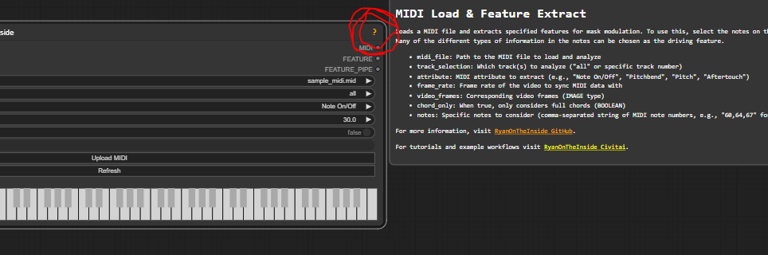

# ComfyUI RyanOnTheInside Node Pack

## 🚨 Important: [Version 2.0 Update](#-important-version-20-update--1) 🚨
## Overview
### These nodes react to **everything**, including audio.


**Everything Reactivity**: Almost all nodes in this pack can be made to react to audio, MIDI, motion, time, color, depth, brightness, and **more**, allowing for incredibly dynamic and responsive workflows. If a node prefixed with  FLEX, then this reactivity is central to its functionality.**

- 💪 **Flex Features**: Dynamic control over IPAdapters, Masks, Images, Videos, Audio, and more
- 🎵 **Audio & MIDI Processing**: Separate instruments, manipulate audio, work with ACEStep and other audio models
- 🎆 **Particle Systems**: Create mesmerizing, fluid-like effects
- 🌊 **Optical Flow**: Generate masks based on motion in videos
- 🎨 **ACEStep Native**: Native ComfyUI implementation for audio repaint and extend functionality
- 🌊 **DEPTH Flow** 🌊: Use flex features to control depthflow nodes, adding parallax animations to your workflows!
- 👤 **AdvancedLivePortrait** 👤: Use flex features to control facial animation expressions! 
- 🎨 **Advanced Controlnet** 🎨: Direct integration with ComfyUI-AdvancedControlnet!
- 🎭 **AnimateDiff** 🎭: Direct integration with ComfyUI-AnimateDiff-Evolved!


### 🚨 Important: Version 2.0 Update 🚨

If you are not getting updates, or are having trouble updating from ComfyUI-Manager, please totally uninstall the nodepack and reinstall it to restore normal update behavior.

### 🎉 What's New in V2
- **License**: This project is now licensed under the MIT License.
- **EVERYTHING reacts to EVERYTHING:** Now you can modulate ALL parameters of ALL Flex nodes! Possibilities increased by multiple orders of magnitude.
- **Optional Feature Inputs**: Feature inputs are now optional! This means these nodes double as a powerful suite for image, mask, and video manipulation even without reactivity! 
- **More Intuitive**: Redesigned with user experience in mind. Less noodles, more intuitive connections.

- **Help**: Takes full advantage of ComfyUI's tooltip system.
- **Manual Feature Creation**: New interface for drawing/creating features manually - far more powerful than it might seem!
- **Text as Features**: New integration with Open AI Whisper allows text to be used as a feature source, with a fully modular trigger system
- **Enhanced External Integration**: Deeper compatibility with external node packs
- **Image Improvements**: Major improvements to FlexImage nodes. One might say they are more than useful now.
- **Mask Improvements**: Major improvements to FlexMask nodes.
- **Performance Improvements**: Major performance improvements in many nodes. More to follow.
- **Feature Modulation**: More robust and feature-rich modulation system.
- **And much more!**


### ⚠️ Breaking Changes Notice
Due to ComfyUI's workflow loading mechanism, **existing workflows using these nodes ~~may~~ *will* break after updating**. I did consider this carefully, as I have yet to introduce breaking changes to this node system, but this extensive update  neccesitated a complete overhaul.

If you need to run an older workflow, you can revert to the previous version of these nodes by using the Manager, or by running this command in your ComfyUI_RyanOnTheInside directory:

```bash
git checkout dab96492ac7d906368ac9c7a17cb0dbd670923d9
```

To return to the latest version later, use:
```bash
git checkout main
```

<table style="border-collapse: collapse; border: none;">
  <tr>
    <td style="border: none; padding: 0 2px 2px 0;">
      
    </td>
    <td style="border: none; padding: 0 0 2px 2px;">
      
    </td>
  </tr>
  <tr>
    <td style="border: none; padding: 2px 0 0 2px;">
      
    </td>
    <td style="border: none; padding: 2px 2px 0 0;">
      
    </td>
  </tr>
  <tr>
    <td style="border: none; padding: 2px 2px 0 0;">
      
    </td>
    <td>
      
    </td>
  </tr>
</table>

*Examples showcasing various effects using particle emitters, vortices, and other node features*

<details><summary><h3>🆕 Recent Updates:</h3></summary>

**VERSION 2.0**

</details>

## 🚀 Quick Start

Getting started with the RyanOnTheInside node pack is easy:

1. Install the node pack as described in the [Installation](#installation) section.
2. Open ComfyUI and look for nodes prefixed with "RyanOnTheInside" in the node browser.
3. Check out the example workflows on Civitai and tutorials on YouTube to see how different features can be used.

### Example and Tutorial Workflows on Civitai
There are many example workflows in this repo, but for the most current, and with all attendent required assets, visit my Civitai profile:
[RyanOnTheInside Civitai Profile](https://civitai.com/user/RyanOnTheInside)

For tutorials on these nodes and more, check out my YouTube channel. Production value low, information dense af:
[RyanOnTheInside YouTube Channel](https://www.youtube.com/@RyanOnTheInside)

## ❓ Help and Documentation

For detailed information on each and every node, click the ❓ icon present in the top-right corner of the node.



## 🚀 Key Features
Particles are now reactive!

[Depthflow compatible!](https://github.com/akatz-ai/ComfyUI-Depthflow-Nodes)
[Live Portrait Compatible!!](https://github.com/PowerHouseMan/ComfyUI-AdvancedLivePortrait)

### 🎛️ Flex Features
Dynamic control over various aspects of your workflow:
- Modulate IPAdapters, Masks, Images, and Particles based on extracted features
- Features include: Audio, MIDI, Motion, Proximity Depth, Color, Time, and more
- Create adaptive, responsive effects that evolve with your input data

### 🎆 Particle Systems
- Multiple particle emitters with customizable settings
- Force fields (Gravity Wells and Vortices) for complex interactions
- Boundary-respecting particles and static body interactions
- Time-based particle modulation (size, speed, color)

### 🎵 Audio and MIDI Processing
- Separate audio into individual instrument tracks
- Extract features from audio and MIDI for visual effects
- Create audio-reactive animations and transformations

### 🎨 ACEStep Native
- **Repaint**: Selectively regenerate specific time ranges in existing audio
- **Extend**: Add new content before or after existing audio  
- **Hybrid**: Combine repaint and extend operations simultaneously

### 🌊 Optical Flow
- Generate masks based on movement in video sequences
- Multiple optical flow algorithms available
- Create motion-reactive particle simulations

### ⏳ Temporal Effects [DEPRECATED]
- You can do all of this 7000x with FlexMask nodes.

## 🤝 Compatible Node Packs

I'm thrilled to announce that external node packs are now compatible with the feature system! Here are some notable examples:

### 🌊 Depthflow Nodes

The [Depthflow Nodes pack](https://github.com/akatz-ai/ComfyUI-Depthflow-Nodes) brings the power of parallax animations to ComfyUI, allowing you to turn 2D images into stunning 2.5D animations. What's even more exciting is that it's fully compatible with my feature system!

Key features of Depthflow Nodes:
- Create complex parallax animations from images and depth maps
- Various motion presets for quick setup
- Fine-grained control with individual motion components

By combining Depthflow Nodes with my feature system, you can create dynamic, responsive parallax animations that react to audio, MIDI, motion, and more. This collaboration opens up a world of creative possibilities for your ComfyUI workflows!

Check out the [Depthflow Nodes repository](https://github.com/akatz-ai/ComfyUI-Depthflow-Nodes) for more information and installation instructions.


### 👤 AdvancedLivePortrait

The [AdvancedLivePortrait nodes](https://github.com/Fannovel16/ComfyUI-AdvancedLivePortrait) bring powerful facial animation capabilities to ComfyUI, and now they're fully compatible with our feature system! This means you can create dynamic, responsive facial animations that react to audio, MIDI, motion, and more.

Key features when combined with our system:
- Control facial expressions using audio features
- Sync lip movements with speech or music
- Create dynamic emotional responses based on various inputs
- Modulate animation parameters in real-time

### 🎭 AnimateDiff

The [AnimateDiff Evolved nodes](https://github.com/Kosinkadink/ComfyUI-AnimateDiff-Evolved) bring powerful animation capabilities to ComfyUI. There is now direct integration with this node pack, and this integration will grow over time! 

### 🎨 Advanced Controlnet


The [Advanced Controlnet](https://github.com/Kosinkadink/ComfyUI-Advanced-ControlNet) bring powerful granular control to ComfyUI. There is now direct integration with this node pack, and this integration will grow over time!


## 📚 Overview Documentation


<details>
<summary><h3>Flex Features</h3></summary>

The Flex Features system allows for dynamic control over various aspects of your workflow by extracting and utilizing different types of features:

#### Audio Features
- **Amplitude Envelope**: Tracks the overall volume changes in the audio
- **RMS Energy**: Measures the average energy of the audio signal
- **Spectral Centroid**: Indicates the "center of mass" of the spectrum
- **Onset Detection**: Detects the beginning of musical notes or events
- **Chroma Features**: Represents the tonal content of the audio

#### MIDI Features
- **Velocity**: Intensity of MIDI note presses
- **Pitch**: Musical note values
- **Note On/Off**: Timing of note starts and ends
- **Duration**: Length of individual notes
- **Density**: Number of active notes over time
- **Pitchbend**: Pitch modulation data
- **Aftertouch**: Pressure applied after initial note press
- **Various CC (Control Change) data**: Modulation, expression, sustain, etc.

#### Motion Features
- **Mean Motion**: Average movement across the frame
- **Max Motion**: Largest movement detected
- **Motion Direction**: Overall direction of movement
- **Horizontal/Vertical Motion**: Movement along specific axes
- **Motion Complexity**: Variation in movement across the frame

#### Depth Features
- **Mean Depth**: Average depth in the scene
- **Depth Variance**: Variation in depth values
- **Depth Range**: Difference between nearest and farthest points
- **Gradient Magnitude**: Rate of depth change
- **Foreground/Midground/Background Ratios**: Proportion of scene at different depths

#### Color Features
- **Dominant Color**: Most prevalent color in the image
- **Color Variance**: Spread of colors used
- **Saturation**: Intensity of colors
- **RGB Ratios**: Proportion of red, green, and blue in the image

#### Brightness Features
- **Mean Brightness**: Overall lightness of the image
- **Brightness Variance**: Spread of light and dark areas
- **Brightness Histogram**: Distribution of brightness levels
- **Dark/Mid/Bright Ratios**: Proportion of image at different brightness levels

#### Time Features
- **Smooth**: Linear progression over time
- **Accelerate**: Increasing rate of change
- **Pulse**: Periodic oscillation
- **Sawtooth**: Rapid rise followed by sudden drop
- **Bounce**: Emulates a bouncing motion

#### Text Features (Whisper)
- **Speech-to-Text**: Convert spoken words from audio into text features
- **Transcription Timing**: Sync features with specific words or phrases
- **Confidence Scores**: Use speech recognition confidence as a feature
- **Language Detection**: Create features based on detected languages
- **Speaker Segments**: Generate features from different speaker segments
- **Sentiment Analysis**: Extract emotional content from spoken words
- **Temporal Alignment**: Map text features to specific timestamps

These features can be used to control almost anything. IPAdapters, masks, images, video.... particle emitters (see below :D)... creating dynamic and responsive effects that adapt to the input data.

</details>

<details>
<summary><h3>Particle Systems</h3></summary>

Create mesmerizing, fluid-like effects through advanced particle simulation:

- **Multiple Emitters**: Create complex particle flows with independent settings
  - Customize spread, speed, size, color, and more for each emitter
- **Force Fields**: Add depth to your simulations
  - Gravity Wells: Attract or repel particles
  - Vortices: Create swirling, tornado-like effects
- **Global Settings**: Fine-tune the overall simulation
  - Adjust gravity and wind for the entire particle space
- **Boundary Interactions**: Particles respect mask shapes and edges
- **Static Bodies**: Add obstacles and surfaces for particles to interact with
- **Spring Joints**: Create interconnected particle systems
- **Time-based Modulation**: Evolve particle properties over time
  - Adjust size, speed, and color dynamically

These features allow for the creation of complex, dynamic particle effects that can be used to generate masks, animate elements, or create stunning visual effects.

</details>

<details>
<summary><h3>Audio and MIDI Processing</h3></summary>

Transform your visuals with the power of sound and musical data:

#### Audio Processing
- **Track Separation**: Isolate vocals, drums, bass, and other instruments
- **Feature Extraction**: Analyze audio for amplitude, frequency, and tonal content
- **Frequency Filtering**: Target specific frequency ranges for processing
- **Visualizations**: Create complex audio-reactive visual effects

#### MIDI Processing
- **Feature Extraction**: Utilize note velocity, pitch, timing, and control data
- **Real-time Input**: Process live MIDI data for interactive visuals
- **Sequencing**: Create rhythmic visual patterns based on MIDI sequences
- **Control Mapping**: Use MIDI controllers to adjust visual parameters

These audio and MIDI processing capabilities enable the creation of music-driven animations, visualizations, and effects that respond dynamically to sound input.

</details>

<details>
<summary><h3>ACEStep Native</h3></summary>

Native ComfyUI implementation of ACEStep audio repaint and extend functionality. This provides seamless integration with ComfyUI's existing sampling infrastructure to enable selective audio regeneration and extension without requiring custom types.

#### Core Functionality Nodes

**ACEStep Repaint Guider**
Creates a guider for repainting specific audio regions.
- **Inputs**: Model, conditioning, source latents, time range, strength settings
- **Output**: GUIDER (for use with SamplerCustomAdvanced)

**ACEStep Extend Guider**  
Creates a guider for extending audio before/after existing content.
- **Inputs**: Model, conditioning, source latents, extend times
- **Output**: GUIDER (for use with SamplerCustomAdvanced)

**ACEStep Hybrid Guider**
Combines repaint and extend functionality in a single node.
- **Inputs**: All repaint/extend parameters with optional controls
- **Output**: GUIDER (for use with SamplerCustomAdvanced)

#### Utility Nodes

- **ACEStep Analyze Latent**: Analyzes ACE latent properties for debugging
- **ACEStep Time Range**: Converts time ranges to frame indices
- **ACEStep Mask Visualizer**: Visualizes repaint masks for debugging
- **ACEStep Audio Post Processor**: Preserves original audio fidelity in unchanged regions

#### Basic Workflows

**Repaint Workflow**: Replace audio content from 10-20 seconds with new generation.
See: [examples/acestep_repaint.json](examples/acestep_repaint.json)

**Extend Workflow**: Add 10 seconds of new content after existing audio.
See: [examples/acestep_extend.json](examples/acestep_extend.json)


</details>

<details>
<summary><h3>Optical Flow</h3></summary>

Harness the power of motion to create stunning visual effects:

- **Multiple Algorithms**: Choose from various optical flow calculation methods
  - Farneback: Dense optical flow estimation
  - Lucas-Kanade: Sparse feature tracking
  - Pyramidal Lucas-Kanade: Multi-scale feature tracking for larger motions
- **Motion-based Masking**: Generate masks that highlight areas of movement
- **Flow Visualization**: Create visual representations of motion in video
- **Particle Interaction**: Use optical flow data to influence particle systems
- **Directional Effects**: Apply effects based on the direction of detected motion

Optical flow analysis allows for the creation of dynamic, motion-responsive effects that can be used for masking, animation, or as input for other visual processes.

</details>


## Installation

Install via the ComfyUI Manager by searching for RyanOnTheInside, or manually by...

1. Navigate to your ComfyUI's `custom_nodes` directory
2. Clone the repository:
   ```
   git clone https://github.com/ryanontheinside/ComfyUI_RyanOnTheInside.git
   ```
3. Navigate to the cloned directory:
   ```
   cd ComfyUI_RyanOnTheInside
   ```
4. Install the required dependencies:
   ```
   pip install -r requirements.txt
   ```
5. Restart ComfyUI if it's currently running and refresh your browser

### Requirements

See `requirements.txt` for a list of dependencies.

## Contributing

*Credit to https://github.com/alanhuang67/ComfyUI-FAI-Node for Voronoi implementation

Contributions are welcome! Both to the code and EXAMPLE WORKFLOWS!!! If you'd like to contribute:

1. Fork the repository
2. Create a new branch for your feature or bug fix
3. Make your changes and commit them with descriptive commit messages
4. Push your changes to your fork
5. Submit a pull request to the main repository

## License

This project is licensed under the MIT License - see the [LICENSE](LICENSE) file for details.

## Support

For issues, questions, or suggestions, please open an issue on the GitHub repository.
