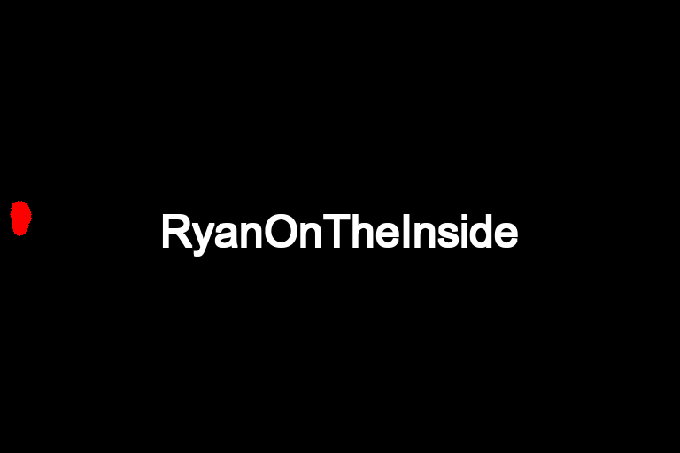
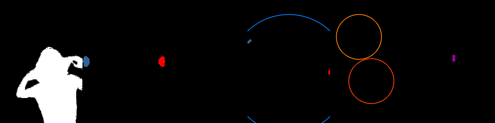
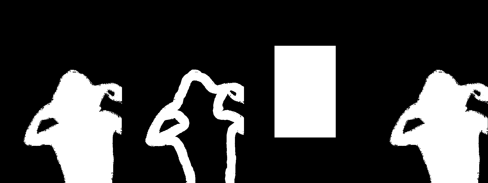

# ComfyUI RyanOnTheInside Node Pack

## Overview
RyanOnTheInside node pack introduces the following (so far):
- Particle Systems
- Optical Flow
- Temporal Masks

  

  

  

  *Some examples using particle emitters and vortices*

## Installation

1. Navigate to your ComfyUI's `custom_nodes` directory
2. Clone the repository:
   ```
   git clone https://github.com/ryanontheinside/ComfyUI_RyanOnTheInside.git
   ```
3. Navigate to the cloned directory:
   ```
   cd ComfyUI_RyanOnTheInside
   ```
4. Install the required dependencies:
   ```
   pip install -r requirements.txt
   ```
5. Restart ComfyUI if it's currently running and refresh your browser


## Requirements

See `requirements.txt` for a list of dependencies.

## Features

### Common Parameters for All Mask Nodes
All mask nodes in this system share the following parameters:

- `Masks`: Input mask or sequence of masks to be processed. (you can pass in a blank mask if you want)
- `Strength`: Overall strength of the effect (0.0 to 1.0). Higher values usually intensify the mask operation.
- `Invert`: When enabled, the node performs operations on the inverse of the input mask.
- `Subtract Original`: Amount of the original mask to subtract from the result (0.0 to 1.0). Useful for creating edge effects or isolating changes.
- `Grow with Blur`: Expands the mask edges using a blur effect (0.0 to 10.0). Higher values create softer, more expanded edges. 

These parameters provide a consistent base for all mask operations, allowing for fine-tuned control over the mask processing across various node types. There are currently three categories of masks...

## Particle System Masks

Create dynamic, fluid-like effects through particle simulation:
- Supports N particle emitters, each with independent settings including movement, particle (spread, speed, size, COLOR, etc)
- Supports N force fields (Gravity Well (repel and attract), and Vortex), each with independent settings
- Each simulation space has basic gravity and wind settings
- Boundary-respecting particle behavior, where the particles try to respect the boundary of a mask.

    

    *A few examples showcasing object-aware particles, initial plume effects, vortex interactions, gravity wells, and directional emitters.*

#### General Parameters for particle system
These settings apply to all particle system mask nodes, and generally apply to the simulation space level.
- `particle_count`: Total number of particles in the system (1 to 10000)
- `particle_lifetime`: Lifetime of each particle in seconds (0.1 to 10.0)
- `wind_strength`: Strength of the wind effect (-100.0 to 100.0)
- `wind_direction`: Direction of the wind in degrees (0.0 to 360.0)
- `gravity`: Strength of gravity (-1000.0 to 1000.0)
- `start_frame`: Frame to start the effect (0 to 1000)
- `end_frame`: Frame to end the effect (0 to 1000)
- `respect_mask_boundary`: Whether particles should respect the mask boundary
- `emitters`: Particle emitter configurations (PARTICLE_EMITTER type)
- `vortices`: Optional vortex configurations (VORTEX type)
- `wells`: Optional gravity well configurations (GRAVITY_WELL type)
- `well_strength_multiplier`: Multiplier for gravity well strength (0.0 to 10.0)

#### Particle Emission Mask
This is the main node for particle simulations. 
This node is particularly useful for creating complex, animated mask effects that can simulate natural phenomena like smoke, water, or energy fields...bowling balls, planets, whatever. The resulting masks can be used in various image processing and generation tasks within ComfyUI workflows.

##### Parameters:
- `masks`: Input mask(s). Optionally interact with the particle system
- `emission_strength`: Strength of particle emission effect (0.0 to 1.0), basically opacity
- `draw_modifiers`: Visibility of vortices and gravity wells (0.0 to 1.0)

##### Optional Parameters:
- `vortices`: Vortex effects to apply to the particle system (VORTEX type)
- `wells`: Gravity well effects to apply to the particle system (GRAVITY_WELL type)
- `well_strength_multiplier`: Multiplier for gravity well strength (0.0 to 10.0)

###### Color Information
These are the colors of the circles should you choose to draw_modifiers (see above). These colors are fixed. Use them if you want to separatly mask the modifier circles. Think, like, the event horizon of a black hole or somthing.
- Vortex: RGB(0, 127, 255) - Blue
- Gravity Well (Attract): RGB(255, 127, 0) - Orange-Red
- Gravity Well (Repel): RGB(255, 64, 0) - Darker Orange-Red

##### Outputs:
- `MASK`: The resulting particle system binary mask
- `IMAGE`: A visualization of the particle system - useful for masking different colors for different particle systems


#### ParticleEmitter Parameters
The Particle Emitter node...creates a particle emitter. They can be chained together to feed N to a particle based node.
- `emitter_x`: X-coordinate of the emitter (0.0 to 1.0)
- `emitter_y`: Y-coordinate of the emitter (0.0 to 1.0)
- `particle_direction`: Direction of particle emission in degrees
- `particle_spread`: Spread angle of particle emission in degrees
- `particle_speed`: Speed of emitted particles
- `particle_size`: Size of emitted particles
- `color`: Color of emitted particles (RGB tuple)
- `emission_rate`: Rate of particle emission
- `initial_plume`: Initial burst of particles (0.0 to 1.0)

##### Optional Movement Parameters
These settings are encapulated in a node that can optionally be fed to particle emitters.

Position Control:
- `emitter_y_frequency`: Rate of vertical oscillation (higher values = faster up-down movement)
- `emitter_y_amplitude`: Maximum vertical distance from center (larger values = taller movement)
- `emitter_x_frequency`: Rate of horizontal oscillation (higher values = faster left-right movement)
- `emitter_x_amplitude`: Maximum horizontal distance from center (larger values = wider movement)


Direction Control:
- `direction_frequency`: Rate of emission angle change (higher values = faster direction shifts)
- `direction_amplitude`: Maximum angle change in degrees (up to 180° in either direction)

These parameters work together to create complex, periodic movements for particle emitters. 
By adjusting frequencies and amplitudes, you can achieve various patterns like circles, 
figure-eights, or more chaotic motions. The direction parameters add extra dynamism by 
altering the angle of particle emission over time.

#### GravityWell Parameters
These are optional inputs for a simulation space. They can be chained together to have N in a given simulation.
- `x`: X-coordinate of the gravity well (0.0 to 1.0)
- `y`: Y-coordinate of the gravity well (0.0 to 1.0)
- `strength`: Strength of the gravity well
- `radius`: Radius of effect for the gravity well
- `type`: Type of gravity well ('attract' or 'repel')


#### Vortex Parameters
These are optional inputs for a simulation space. They can be chained together to have N in a given simulation.
- `x`: X-coordinate of the vortex center (0.0 to 1.0)
- `y`: Y-coordinate of the vortex center (0.0 to 1.0)
- `strength`: Strength of the vortex effect (0.0 to 1000.0)
- `radius`: Radius of effect for the vortex (10.0 to 500.0)
- `inward_factor`: Factor controlling how quickly particles are pulled towards the center (0.0 to 1.0)
- `movement_speed`: Speed of movement of the vortext object (0.0 to 10.0)


## Optical Flow Masks

Motion-based effects:

- Multiple optical flow algorithms (Farneback, Lucas-Kanade, Pyramidal Lucas-Kanade)
- Particle simulations reactive to optical flow - work in progress
- Directional flow isolation and emphasis  - in progress
- Advanced blending and modulation options

### Optical Flow Mask Nodes

#### General optical mask settings
These settings apply across the different optical flow masks, and modulate the input mask based on optical flow, creating dynamic mask animations.

- `Images`: Input image sequence for optical flow calculation
- `Masks`: Input mask sequence to be processed
- `Strength`: Overall strength of the effect (0.0 to 1.0)
- `Flow Method`: Technique used for optical flow calculation
  - Options: "Farneback", "LucasKanade", "PyramidalLK"
- `Flow Threshold`: Minimum flow magnitude to consider (0.0 to 1.0)
- `Magnitude Threshold`: Relative threshold for flow magnitude (0.0 to 1.0)


#### OpticalFlowMaskModulation
This is currently the main Optical Flow node. Use it to make motion based effects.

- `Modulation Strength`: Intensity of the modulation effect (0.0 to 5.0)
- `Blur Radius`: Smoothing applied to the flow magnitude (0 to 20 pixels)
- `Trail Length`: Number of frames for the trail effect (1 to 20)
- `Decay Factor`: Rate of trail decay over time (0.1 to 1.0)
- `Decay Style`: Method of trail decay
  - Options: "fade" (opacity reduction), "thickness" (width reduction)
- `Max Thickness`: Maximum trail thickness for thickness-based decay (1 to 50 pixels)

#### Optical Flow Direction Mask - work in progress
This node will create masks based on the direction of optical flow, allowing for selective masking of moving areas.
<!--
- Inherits all parameters from Optical Flow Mask Base
- `Direction`: Flow direction to mask
  - Options: "horizontal", "vertical", "radial_in", "radial_out", "clockwise", "counterclockwise"
- `Angle Threshold`: Tolerance for direction matching (0.0 to 180.0 degrees)
- `Blur Radius`: Smoothing applied to the resulting mask (0 to 20 pixels)
- `Invert`: Option to invert the output mask
-->
#### Optical Flow Particle System - work in progess
This node will generate a particle system animation driven by optical flow, creating dynamic visual effects.
<!--
- Inherits all parameters from Optical Flow Mask Base
- `Particle Count`: Number of particles in the system (100 to 10000)
- `Particle Size`: Diameter of each particle (1 to 50 pixels)
- `Particle Color`: Color of the particles (hex color code)
- `Particle Opacity`: Transparency of particles (0.0 to 1.0)
- `Flow Multiplier`: Influence of optical flow on particle movement (0.1 to 5.0)
- `Particle Lifetime`: Duration of each particle's existence (1 to 100 frames)
- `Initial Velocity`: Starting speed of newly emitted particles (0.1 to 5.0)
-->

## Temporal Masks

Implement time-based transformations and animations:

- Morphing and transformation effects (erosion, dilation, translation, rotation, scaling)
- Various mask combination methods
- Radial and pulsating effects
- Warp effects using Perlin noise, radial distortion, and swirling patterns
- Customizable easing functions and palindrome support

  

  *Examples of various combinations of temporal mask effects including morphing, transformations, math , and warping.*


- `Start Frame`: The frame number where the effect begins (0 to 1000).
- `End Frame`: The frame number where the effect ends (0 to 1000). If set to 0, processes until the last frame.
- `Effect Duration`: Number of frames over which the effect is applied (0 to 1000). If 0, uses (End Frame - Start Frame).
- `Temporal Easing`: Determines how the effect strength changes over time.
  - Options: "ease_in_out", "linear", "bounce", "elastic", "none"
- `Palindrome`: When enabled, the effect plays forward then backward within the specified duration.


#### Mask Morph
Applies morphological operations to the mask, changing its shape over time.

- `Morph Type`: The type of morphological operation to apply.
  - Options: "erode", "dilate", "open", "close"
- `Max Kernel Size`: Maximum size of the morphological kernel (3 to 21, odd numbers only).
- `Max Iterations`: Maximum number of times to apply the operation (1 to 50).

#### Mask Transform
Applies geometric transformations to the mask over time.

- `Transform Type`: The type of transformation to apply.
  - Options: "translate", "rotate", "scale"
- `X Value`: Horizontal component of the transformation (-1000 to 1000).
- `Y Value`: Vertical component of the transformation (-1000 to 1000).

#### Mask Math
Combines two masks using various mathematical operations.

- `Mask B`: Second mask to combine with the input mask.
- `Combination Method`: Mathematical operation to apply.
  - Options: "add", "subtract", "multiply", "minimum", "maximum"

#### Mask Rings
Creates concentric ring patterns based on the distance from the mask edges.

- `Num Rings`: Number of rings to generate (1 to 50).
- `Max Ring Width`: Maximum width of each ring as a fraction of the total distance (0.01 to 0.5).

#### Mask Warp
Applies various warping effects to the mask.

- `Warp Type`: The type of warping effect to apply.
  - Options: "perlin", "radial", "swirl"
- `Frequency`: Frequency of the warping effect (0.01 to 1.0).
- `Amplitude`: Intensity of the warping effect (0.1 to 500.0).
- `Octaves`: Number of octaves for noise-based warps (1 to 8).

All these nodes inherit the common parameters from MaskBase and TemporalMaskBase, allowing for precise control over the timing and strength of the effects across multiple frames.


### Miscellaneous Nodes

#### MovingShape

Generate animated mask sequences featuring a moving shape with customizable parameters.

Parameters:
- `frame_width`: Width of each frame (1-3840 pixels)
- `frame_height`: Height of each frame (1-2160 pixels)
- `num_frames`: Number of frames in the sequence (1-120)
- `rgb`: Color of the shape in RGB format, e.g., "(255,255,255)"
- `shape`: Shape type ("square", "circle", or "triangle")
- `shape_width_percent`: Width of the shape as a percentage of frame width (0-100%)
- `shape_height_percent`: Height of the shape as a percentage of frame height (0-100%)
- `shape_start_position_x`: Starting X position of the shape (-100 to 100)
- `shape_start_position_y`: Starting Y position of the shape (-100 to 100)
- `shape_end_position_x`: Ending X position of the shape (-100 to 100)
- `shape_end_position_y`: Ending Y position of the shape (-100 to 100)
- `movement_type`: Type of movement ("linear", "ease_in_out", "bounce", or "elastic")
- `grow`: Growth factor of the shape during animation (0-100)
- `palindrome`: Whether to reverse the animation sequence (True/False)
- `delay`: Number of static frames at the start (0-60)

This node creates a mask sequence with a moving shape, allowing for various animations and transformations.

#### TextMaskNode

Generate mask and image sequences featuring customizable text.

Parameters:
- `width`: Width of the output image (1-8192 pixels)
- `height`: Height of the output image (1-8192 pixels)
- `text`: The text to be rendered
- `font`: Font to be used (selectable from system fonts)
- `font_size`: Size of the font (1-1000)
- `font_color`: Color of the text in RGB format, e.g., "(255,255,255)"
- `background_color`: Color of the background in RGB format, e.g., "(0,0,0)"
- `x_position`: Horizontal position of the text (0.0-1.0, where 0.5 is center)
- `y_position`: Vertical position of the text (0.0-1.0, where 0.5 is center)
- `rotation`: Rotation angle of the text (0-360 degrees)
- `max_width_ratio`: Maximum width of text as a ratio of image width (0.1-1.0)
- `batch_size`: Number of images to generate in the batch (1-10000)

This node creates both a mask and an image with the specified text, allowing for various text-based effects and animations. The text automatically wraps to fit within the specified maximum width.


## Contributing

Contributions are welcome! Both to the code and EXAMPLE WORKFLOWS!!! If you'd like to contribute:

1. Fork the repository
2. Create a new branch for your feature or bug fix
3. Make your changes and commit them with descriptive commit messages
4. Push your changes to your fork
5. Submit a pull request to the main repository

## License

This project is licensed under the Creative Commons Attribution-NonCommercial 4.0 International License (CC BY-NC 4.0).

You are free to share and adapt the material for non-commercial purposes, as long as you give appropriate credit and indicate if changes were made.

For more details, see the [full license text](https://creativecommons.org/licenses/by-nc/4.0/legalcode).

## Support

For issues, questions, or suggestions, please open an issue on the GitHub repository.
